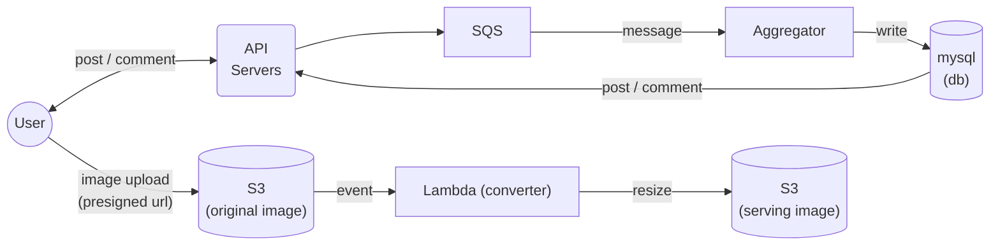

# Toy Instagram

**Write posts, comments and upload images**

## Table of Contents

- [Overview](#overview)
- [Architecture](#architecture)
- [Prerequisites](#prerequisites)
- [Installation](#installation)
- [Shipping to production](#shipping)

## Overview

This project is a toy service consisting of an API server, queue, database, and image storage components. SQS, DB, S3, and Lambda functions are already deployed on AWS. For testing, follow the instructions below.

## Architecture



### API Server

Written in Node.js (v18), TypeScript with Fastify backend. Writes to SQS for new posts and comments and reads from the database for data requests.

Returns immediately without waiting for the database to update. Uses <b>JWT</b> for user authentication.

##### folder structure

    serverless
    ├── database        # lambda for database writes
    ├── storage         # lambda for image resize
    src
    ├── configs         # config(db)
    ├── controllers     # API schemas and controllers(Fastify)
    │   ├── comment
    │   ├── middlewares # middlewares for authentication and response formatting
    │   ├── post
    │   ├── user
    ├── migrations      # database schema(typeorm used)
    ├── repositories    # mysql repository for comment and post read / write
    ├── services        # all business logics here

### Aggregator

A single Lambda function for data aggregation. Currently, it writes data to the database.

## Prerequisites

- Node.js 18.16.0
- Serverless CLI
- MySQL
- AWS credentials

## Installation

Please look at \_\_test\_\_ folder to see sample api calls

**Using Node.js:**

> Server runs on 8080 port

```shell
# Example installation steps
$ git clone https://github.com/onejae/tiny-imagegram
$ cd tiny-imagegram
$ npm install
$ npm run build
$ node dist/index.js
```

**Using Docker:**

```shell
# Example installation steps
$ git clone https://github.com/onejae/tiny-imagegram
$ cd tiny-imagegram
$ docker build . -t bl-api-test
$ docker run --network host -d --env-file aws-sec.env bl-api-test
```

## <a id="shipping"></a>Shipping to production

1.  Setup AWS services

    1. Database

       1. Create RDS instance on AWS
       2. Migrate the schema to RDS using TypeORM.

       ```shell
       $ cd serverless/database
       $ npx typeorm migration:run -- -d ./src/provideers/datasource.ts # you need to provide proper datasource with rds configure for typeorm
       ```

       3. Set the database connection information in serverless.yaml and the .env file for API servers (or use AWS Secret Manager).

    2. SQS(Simple Queue Service)
       1. Create SQS(fifo) on AWS
       2. Set the SQS url to .env file for API servers

2.  Deploy Lambda and S3 buckets

    1. storage service

       ```shell
       $ cd serverless/storage
       $ npm install --omit=dev
       $ serverless deploy
       ```

    2. database service

       ```shell
       $ cd serverless/database
       $ npm install --omit=dev
       $ serverless deploy
       ```

       The following is an example of gitlab pipeline

       ```yml
       build:
        stage: build
        image: node:18
        script:
            - npm install --omit=dev
        artifacts:
            paths:
                - "\*"
        tags:
        - {specify your runner}
       deploy:
        stage: deploy
        image: amaysim/serverless:3.35.2
        script:
            - serverless deploy
        tags: - {specify your runner}
       ```

3.  Deploy API Servers
    **API servers must have permissons to send message to SQS, and read from RDS**
    API servers can be deployed in any platform. Docker with beanstalk or K8s is recommended. 
